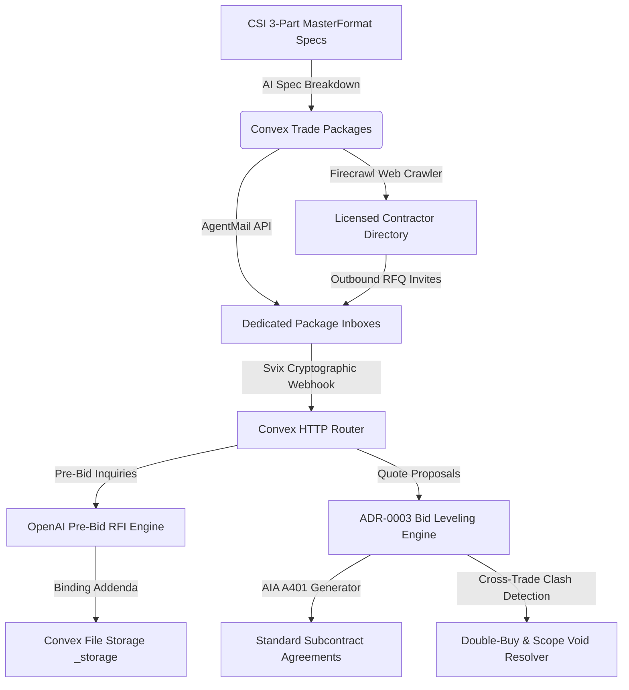

# TradePulse Pro ⚡

> **Autonomous CSI MasterFormat Subcontractor Procurement, Dynamic Pre-Bid Q&A & Real-Time Bid Leveling for Commercial Construction**

[](https://vibeapps.dev/judging/convex-all-gas-hackathon-openai)
[](https://brainy-skunk-440.convex.site)
[](https://www.typescriptlang.org/)
[](https://react.dev/)
[](https://tailwindcss.com/)

---

## 🌐 Live Access & Deployment

| Resource | URL |
| :--- | :--- |
| **Official Web Application** | **[https://brainy-skunk-440.convex.site](https://brainy-skunk-440.convex.site)** |
| **LLMs Discoverability Manifest** | **[https://brainy-skunk-440.convex.site/llms.txt](https://brainy-skunk-440.convex.site/llms.txt)** |
| **Convex Cloud Production Backend** | **[https://brainy-skunk-440.convex.cloud](https://brainy-skunk-440.convex.cloud)** |
| **AgentMail Live Webhook Endpoint** | **[https://brainy-skunk-440.convex.site/agentmail/webhook](https://brainy-skunk-440.convex.site/agentmail/webhook)** |

---

## 🎯 The Problem: The $186,000 Scope Exclusion Trap

In commercial construction (hospitals, labs, towers), General Contractors (GCs) solicit bids from trade subcontractors (Electrical, HVAC, Plumbing). Subcontractors frequently submit **deceptive low bids** on paper ($1,100,000 vs $1,225,000), but hide critical exclusions in fine print:
- Excluded crane hoisting to penthouse mechanical rooms (+$45,000 GC cost)
- Excluded UL 1479 rated firestop penetrations (+$22,000 GC cost)
- Excluded seismic engineered structural bracing (+$55,000 GC cost)
- Non-compliant Certificate of Insurance ($1M limit vs required $5M, +$15,000 penalty)
- 16-week long-lead equipment delays (+$24,000 schedule delay impact)

When GCs award purely based on base price, they suffer **six-figure change orders** and schedule blowouts. Furthermore, trades frequently **double-buy equipment** (e.g. both Division 26 Electrical and Division 23 HVAC bidding Variable Frequency Drives, causing $38,500 in redundant spend) or leave **scope voids** (e.g. low-voltage control wiring excluded by both).

---

## ⚡ Solution: TradePulse Pro

TradePulse Pro automates the entire MEP subcontractor buyout lifecycle end-to-end:
1. **CSI MasterFormat Scoping**: Auto-parses architectural specifications into Division 26 (Electrical), Division 23 (HVAC), and Division 22 (Plumbing) packages with dedicated `@agentmail.to` inboxes.
2. **Autonomous Subcontractor Discovery (Firecrawl)**: Searches regional contractor sites for candidate bidders and records the provenance of every data point. License numbers, phone numbers and emails are only stored when the source actually publishes them; records are labeled "Unverified" unless the source itself is a state registry page.
3. **Dynamic Pre-Bid Q&A (AgentMail & OpenAI)**: Ingests subcontractor email RFIs via AgentMail with cryptographic Svix verification, answers technical questions against the spec, and compiles binding **CSI Addendum No. 01** documents stored in Convex File Storage (`_storage`).
4. **Forensic Bid Leveling Engine (ADR-0003)**: Automatically parses proposals, normalizes hidden exclusions, applies lead-time delay adjustments and COI penalties, and accounts for Value Engineering (VE) alternates.
5. **Cross-Trade Scope Clash Engine**: Detects Double-Buys and Scope Voids between electrical and mechanical trades with 1-click buyout deductions.
6. **AIA Document A401 Contract Generator**: Instantly produces standard 10-article AIA subcontracts with financial attestations, retainage terms, and liquidated damages.

---

## 🏛️ Architecture & Sponsor Synergy Matrix

TradePulse Pro deeply integrates all 4 hackathon sponsors:



### 1. Convex (All-Gas Full-Stack Reactive Backend)
* **Real-time WebSockets**: Zero-polling reactive UI updates across all bidders, RFIs, leveling matrices, and audit streams (`useQuery`, `useMutation`).
* **Convex Crons (`convex/crons.ts`)**: Scheduled hourly bid deadline sweeps (`monitor-bid-deadlines`) and 6-hour contractor compliance audits (`audit-contractor-compliance`).
* **Convex File Storage (`_storage`, `convex/files.ts`)**: Secure persistence for CSI specs, BIM drawing PDFs, ACORD 25 COIs, and generated Addenda.
* **Official Static Hosting (`@convex-dev/static-hosting`)**: Unified single-command deployment with production SPA fallback and Wayne Sutton `/llms.txt` discoverability.

### 2. OpenAI & Multi-Model Pipeline (`convex/llmRouter.ts`)
* **GPT-4o Spec Scoping & Pre-Bid RFI Analysis**: Technical inquiry extraction against Division 26/23 specifications.
* **Structured Bid Parsing**: Extracts line items, quantities, unit prices, exclusions, and VE alternates.
* **Multi-Model Support**: Google Gemini and Anthropic Claude run the live pipeline today; OpenAI GPT-4o is a **BYOK adapter** that activates the moment an `OPENAI_API_KEY` is configured (the hackathon provides no OpenAI API credits). A deterministic offline construction-intelligence fallback keeps the pipeline alive even with no provider keys at all.

### 3. Firecrawl (`@firecrawl/firecrawl-convex`, `convex/contractorDiscovery.ts`)
* **Subcontractor Web Discovery**: Autonomous discovery of MEP specialty contractors by location and trade division.
* **Provenance-First Records**: Scrapes contractor domains for published contacts and license numbers and labels each record with its source. Nothing is presented as state-verified unless a registry page was actually the source.

### 4. AgentMail (`@agentmail/convex`, `convex/emailActions.ts`, `convex/http.ts`)
* **Dedicated Project Inboxes**: Auto-provisions `@agentmail.to` inboxes per CSI trade package (Div 26 Electrical, Div 23 HVAC, Div 22 Plumbing) on the AgentMail free tier. When the plan's inbox limit is reached, new packages reuse an existing inbox and the UI labels it as shared instead of claiming a dedicated address.
* **Cryptographic Svix Verification**: Validates `svix-id`, `svix-timestamp`, and `svix-signature` on inbound emails at `/agentmail/webhook`.
* **Two-Way Communication**: Transmits outbound invitations to bid and ingests inbound contractor RFIs and quote proposals directly into the Convex pipeline.

---

## 📊 The ADR-0003 Normalization Formula

$$\text{Leveled Total Cost} = \text{Base Bid} + \sum(\text{Active Exclusions}) + \text{Lead Time Penalty} + \text{COI Deficiency Penalty} - \sum(\text{Accepted VE Alternates})$$

### The Alterman vs. Rosendin Electric Case Study:
* **Alterman, Inc.**:
  * Base Bid: $\$1,100,000$ *(Looks like the lowest bidder!)*
  * Crane Hoisting Excluded: $+\$45,000$
  * UL 1479 Firestopping Excluded: $+\$22,000$
  * Seismic Bracing Excluded: $+\$55,000$
  * Schedule Lead Time Penalty (16 wks vs 12 wks target @ \$6,000/wk): $+\$24,000$
  * COI Penalty (\$1M policy vs \$5M required): $+\$15,000$
  * **Normalized Leveled Cost: $\$1,286,000$**
* **Rosendin Electric, Inc.**:
  * Base Bid: $\$1,225,000$
  * Exclusions: $\$0$ *(All mandatory inclusions covered)*
  * VE Alternate 01 (Aluminum MC feeder cable): $-\$35,000$ *(Optional GC savings)*
  * **Normalized Leveled Cost: $\$1,225,000$ (or $\$1,190,000$ with VE accepted)**
* **Financial Decision**: Awarding Rosendin Electric saves the GC **$\$61,000$ to $\$96,000$** and prevents catastrophic site delays.

---

## ⚡ 60-Second Judge Evaluation Walkthrough

Want to experience the complete platform in 60 seconds?
1. Open the live deployment: **[https://brainy-skunk-440.convex.site](https://brainy-skunk-440.convex.site)**.
2. In the top navigation bar, click the glowing **⚡ 60s Judge Dock** button.
3. Click **"⚡ 1-Click Run Full Autonomous Procurement Lifecycle"**:
   * Watch the live Activity Audit Stream log every step in real-time.
   * Scopes Division 26 Electrical, 23 HVAC, and 22 Plumbing.
   * Discovers contractors and provisions AgentMail inboxes.
   * Clarifies RFIs and generates binding CSI Addendum No. 01.
   * Compares bids in the ADR-0003 Side-by-Side Leveling Matrix.
   * Awards Rosendin Electric and generates an authentic **AIA Document A401 Subcontract Agreement**.
4. Click **Scope Clash Engine**: Review cross-trade coordination catching the **$38,500 VFD Double-Buy** and click **"Deduct Credit"**.

---

## 🛠️ Local Development & Testing

### Prerequisites
* Node.js v20+
* Python 3.10+ (for verification test suites)

### Setup
```bash
# Clone the repository
git clone https://github.com/bO-05/tradepulse-pro.git
cd tradepulse-pro

# Install exact locked dependencies (npm install also works)
npm ci

# Run frontend development server
npm run dev
# -> http://localhost:5173/

# Run Convex local backend
npx convex dev
```

### Verification & Testing
```bash
# Build the frontend first (a fresh clone has no dist/ yet; the Python suite checks it)
npm run build

# 36 domain, sponsor, and architecture deliverable tests -> expect 36/36 PASS
python tests/test_tradepulse.py

# Hackathon setup and log verification -> expect ALL VERIFICATION TESTS PASSED
python tests/verify_setup.py

# Unit + integration tests -> expect 80/80
npx vitest run

# Type-check -> expect no output, exit 0
npx tsc -b

# Docs integrity (links + log order) and offline rendering of the curated reports
npm run verify:docs
npm run verify:reports

# Live guarantee smoke against the deployment (creates and deletes one AUDIT-* fixture)
npm run smoke:live
```

---

## 🧾 Audits & Verification

The full audit trail lives in [`docs/audits/`](./docs/audits/README.md) — self-contained HTML reports
(open by double-click, no network needed):

| Report | What it covers |
| :--- | :--- |
| [audit-1-ux.html](./docs/audits/audit-1-ux.html) | First UX audit of the deployed app. |
| [audit-2-user-journey.html](./docs/audits/audit-2-user-journey.html) | Five-persona user-journey audit (BUG-01…BUG-36). |
| [audit-3-adversarial.html](./docs/audits/audit-3-adversarial.html) | Independent audit v3 with adversarial passes (AUD-01…AUD-05). |
| [audit-4-ui.html](./docs/audits/audit-4-ui.html) | Human-operator UI audit (F1…F12). The [.md copy](./docs/audits/audit-4-ui.md) is machine-readable. |
| [audit-5-remediation.html](./docs/audits/audit-5-remediation.html) | Remediation pass 2: F1–F12 verification table, new findings, claim-change decisions, convergence log, before/after evidence. |

**Current state (audit 5).** All Critical/High/Medium findings were fixed and re-verified live;
F10/F11 could not be reproduced and are marked as such rather than "fixed." Regression is green:
`npx tsc -b` clean, `npx vitest run` 80/80, `python tests/test_tradepulse.py` 36/36. Live
verification harness: [`scripts/qa/`](./scripts/qa/README.md).

---

## 📄 License
MIT License. Built for the Convex All Gas Hackathon 2026.
